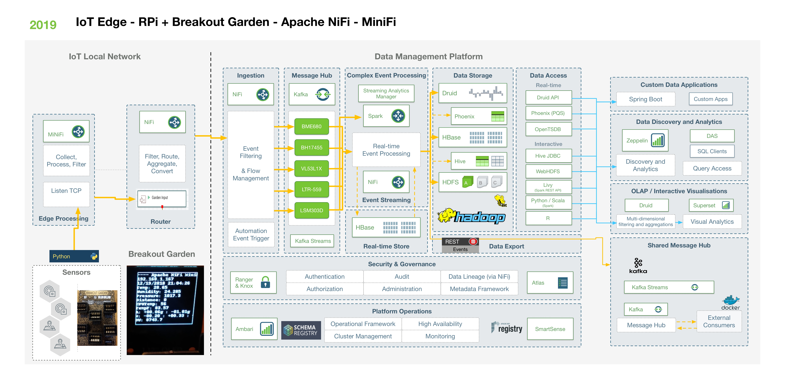
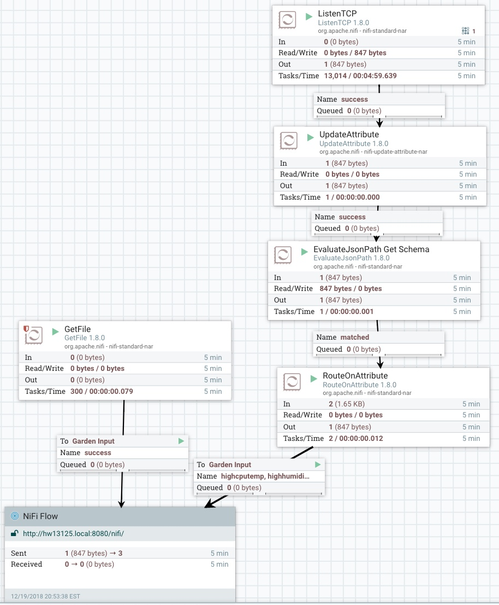

# minifi-breakoutgarden

Using MiniFi with the Pimoroni Breakout Garden Hat and Sensors

### Python -> TCP JSON -> MiniFi ListenTCP -> S2S HTTP NiFi Router -> S2S HTTP HDF 3.3 Cluster NiFi 1.8.0

### These run on Raspberry Pi 3B+ with latest Raspian Image

##  classify-nifi.py

You need to update and upgrade Raspian to newest
You need to install OpenCV from source and build.  
You need Python and PIP

pip install tensorflow

### Timothy Spann @PaasDev

### TODO:   https://pypi.org/project/python-daemon/

### TODO:   Memory cleanup, proper shutdown, buffers, add in tensorflow

### TODO:   Server processing:   Send to kafka topics.   Kafka Streaming Microservices to process

### TODO:   Run Kafka Streams Apps on YARN 3.1

